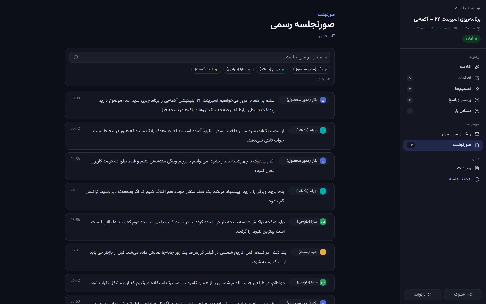
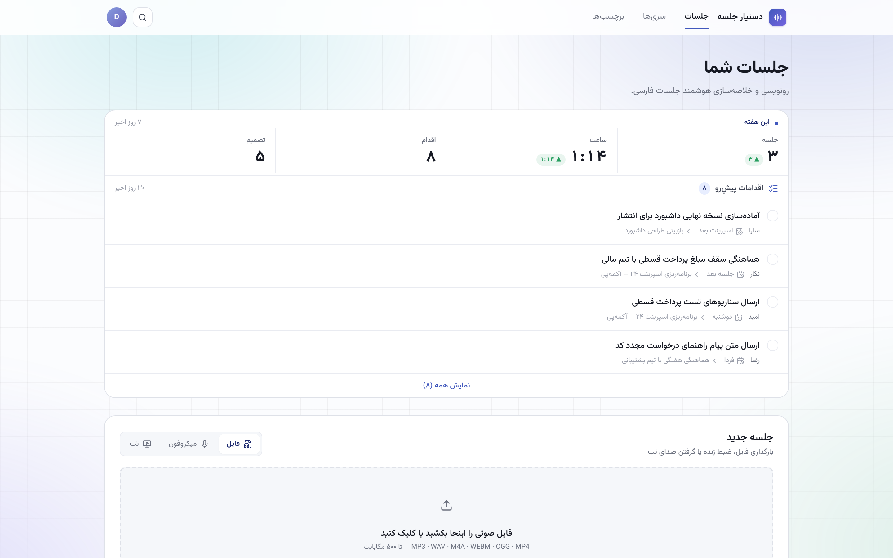
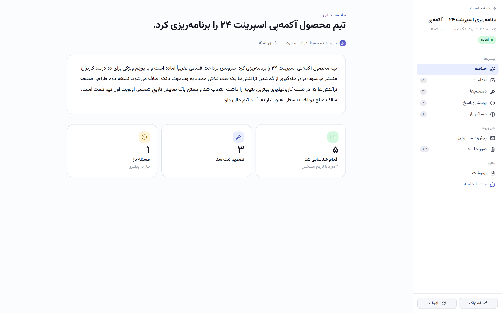
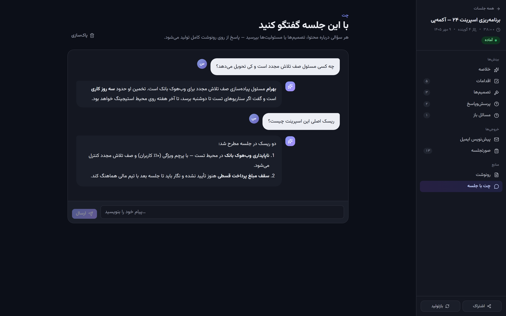
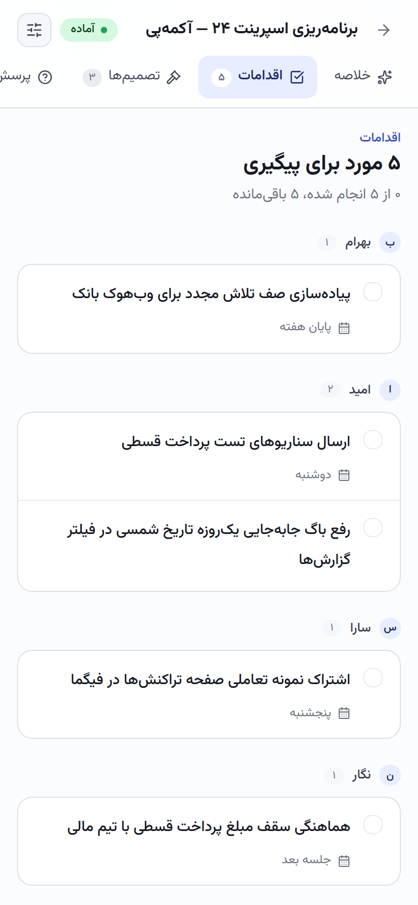
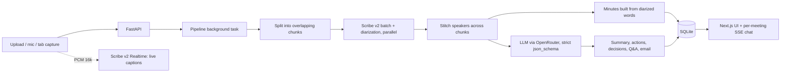

# Meeting Assistant



*Minutes: speaker-attributed, time-stamped segments with search and per-speaker filters (demo data).*

**Drop in a Persian meeting recording; get back who said what, the decisions, the action items, and a follow-up email.**


Persian-first AI meeting recorder: record or upload a meeting, get a speaker-diarized transcript, and turn it into structured minutes, action items, decisions, Q&A and a follow-up email draft.

> FastAPI, SQLAlchemy 2.0 (async), Next.js 16, ElevenLabs Scribe v2, OpenRouter (Gemini 3 Flash Preview).

## Highlights

- Long recordings are transcribed in parallel chunks, and speakers are stitched back together across chunk seams.
- The LLM returns summaries through a strict JSON schema, so the UI always gets well-formed action items, decisions and Q&A.
- Speaker-attributed minutes come from the diarized words, not from the model, so who-said-what can't be hallucinated.
- Persian end to end: RTL UI, Jalali dates, Persian digits, per-series glossaries fed to the ASR as keyterms.
- Three ways in: file upload, microphone, or a browser tab (Meet, Zoom Web, Teams Web), with live captions while recording.
- Per-meeting chat over the transcript, streamed over SSE. Light and dark themes follow the OS.

## Screenshots

All screenshots show the real UI running on a seeded, fictional workspace (demo data: made-up team "Acme Pay", made-up speakers; no LLM or ASR calls).

| | |
|---|---|
|  |  |
| **Dashboard.** Weekly stats and open action items pulled from every meeting (demo data). | **Executive summary.** One-paragraph summary plus counts of actions, decisions and open questions (demo data). |
|  |  |
| **Chat with the meeting.** Answers grounded in the transcript and artifacts (demo data). | **Action items on mobile,** grouped by owner (demo data). |

## Why it's interesting

- **Chunked diarization with speaker stitching.** Long recordings are split into overlapping chunks that are sent to Scribe in parallel. Each chunk numbers its speakers independently, so `_stitch` in [`transcription.py`](backend/app/services/transcription.py) rebases timestamps, maps local speaker ids to global ones by voting on the overlap window, and de-duplicates words at a midpoint boundary.
- **Strict structured output.** Summaries are requested from the LLM with `response_format: json_schema` and `strict: true` ([`summarizer.py`](backend/app/services/summarizer.py)), then validated, so the UI always receives well-formed action items, decisions and Q&A.
- **Facts from data, prose from the LLM.** Speaker-attributed minutes are built server-side from the diarized words, not generated by the model, so attribution cannot be hallucinated.
- **Persian end to end.** Transcription defaults to `fas`, the UI handles RTL text ([`frontend/lib/rtl.ts`](frontend/lib/rtl.ts)), and per-series glossaries are passed to Scribe as keyterms to improve names and jargon.
- **Live captions plus an authoritative pass.** Browser mic or tab audio is streamed to Scribe Realtime over WebSocket for display-only captions, while the stop-time batch diarization is what gets saved.

## Architecture



Meeting state machine: `uploaded -> transcribing -> summarizing -> done` (or `failed`). The pipeline runs as a FastAPI `BackgroundTask`, is idempotent, and can be cancelled mid-run.

## Features

- Three ingest modes: file upload, microphone, or another browser tab (Meet, Zoom Web, Teams Web) via `getDisplayMedia`.
- Seven artifacts: executive summary, action items, decisions, minutes, Q&A, open questions, follow-up email (formal or casual).
- **Series** for recurring meetings: shared glossary, remembered speaker names, email tone. A fuzzy matcher (`rapidfuzz`) suggests a series on upload.
- **Tags** and search to filter the meeting list.
- Per-meeting chat, streamed over SSE, grounded in the transcript and all artifacts.
- OIDC (Keycloak-style) login handled by the backend, session cookie, login rate limiting.

## Tech stack

Backend: Python 3.12, FastAPI, SQLAlchemy 2.0 async, Alembic, SQLite, `uv`.
Frontend: Next.js 16 (App Router), Tailwind 4, shadcn/ui, pnpm.
AI: ElevenLabs Scribe v2 (batch and realtime), OpenRouter.

## Key techniques

| Technique | Where |
|---|---|
| Parallel chunked transcription and speaker stitching | `backend/app/services/transcription.py` |
| Strict JSON-schema LLM output | `backend/app/services/summarizer.py`, `backend/app/prompts/summary_system.txt` |
| Pipeline state machine, cancellation | `backend/app/services/pipeline.py` |
| Glossary keyterms for ASR | `backend/app/services/glossary.py` |
| Speaker-name memory, series matching | `backend/app/services/speakers.py`, `series_match.py` |
| Realtime token minting, browser WebSocket client | `backend/app/services/realtime_token.py`, `frontend/lib/scribe-realtime.ts` |
| SSE chat over meeting context | `backend/app/services/chat.py` |

## Getting started

Requirements: Python 3.12 with [`uv`](https://docs.astral.sh/uv/), Node 22 with `pnpm`, `ffmpeg`.

```bash
# backend
cd backend
cp .env.example .env     # set ELEVENLABS_API_KEY, OPENROUTER_API_KEY, SESSION_SECRET (>=32 chars)
uv sync
uv run alembic upgrade head
uv run uvicorn app.main:app --host 127.0.0.1 --port 8000

# frontend (second shell)
cd frontend
cp .env.example .env.local
pnpm install
pnpm dev                 # http://localhost:3000
```

Login uses OIDC. Fill the `OIDC_*` variables in `backend/.env` with a confidential client from your identity provider (see comments in `.env.example`). Mic and tab capture need HTTPS or `localhost`.

### Demo mode (no API keys, no identity provider)

`scripts/seed_demo.py` fills a throwaway SQLite database with a fictional Persian workspace and prints a signed session cookie, so the UI can be browsed without OIDC. Nothing in it calls ElevenLabs or OpenRouter.

```bash
cd backend
export DATABASE_URL=sqlite+aiosqlite:///./demo.db STORAGE_DIR=./storage-demo ALLOWED_ORIGIN=http://127.0.0.1:4140
PYTHONPATH=. uv run python ../scripts/seed_demo.py     # recreates tables; last line: ma_session=<cookie>
uv run uvicorn app.main:app --host 127.0.0.1 --port 4141

cd ../frontend
NEXT_PUBLIC_API_BASE=http://127.0.0.1:4141/api pnpm build
pnpm exec next start -H 127.0.0.1 -p 4140
```

Set the printed `ma_session` cookie for `127.0.0.1` in the browser, or regenerate the README screenshots with `node scripts/capture-screenshots.cjs http://127.0.0.1:4140 <cookie>` (needs Playwright on `NODE_PATH`).

For a Linux server, `bootstrap.sh` and `setup.sh` install prerequisites and run both apps under pm2 (see [`INSTALL.md`](INSTALL.md)); `deploy/` has template pm2, nginx and Caddy configs with placeholder hosts.

## Tests

```bash
cd backend && uv run pytest -q          # one live-Scribe smoke test is skipped without a key
cd frontend && pnpm lint && pnpm exec tsc --noEmit && pnpm build
```

GitHub Actions ([`.github/workflows/ci.yml`](.github/workflows/ci.yml)) runs the backend tests and the frontend lint, typecheck and build.

## Limits

- Persian only by default (`language_code=fas`); change it in `transcription.py` for another language.
- No live diarization: speaker labels come from the batch pass after stop.
- Uploads are single blobs capped at 500 MB; no background worker queue.
- Audio is kept on disk with no cleanup job.
- Chrome/Edge fully supported; Firefox tab audio is partial; Safari untested.

## License

MIT, see [LICENSE](LICENSE).

---

<sub>Built by <a href="https://sepehrradmard.ir">Sepehr Radmard</a> · <a href="https://www.linkedin.com/in/sepehr-radmard/">LinkedIn</a> · <a href="https://github.com/sepehr071">GitHub</a> · more projects on my <a href="https://github.com/sepehr071">profile</a></sub>
